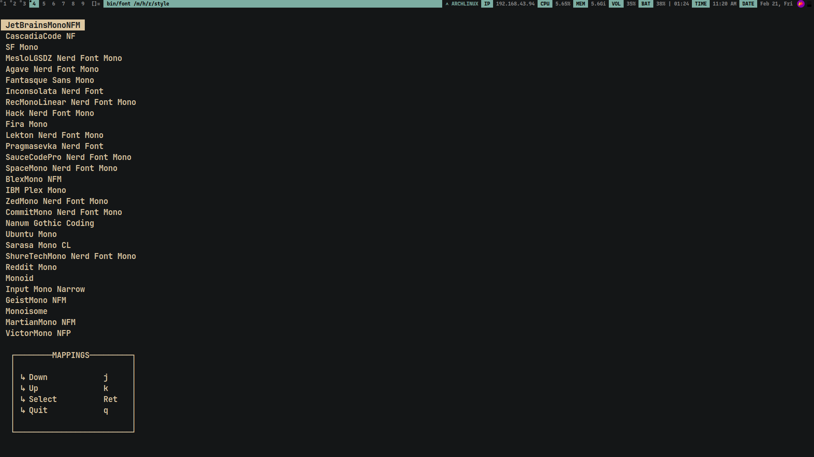

# Purpose

- Used in order to efficiently synchronize theming and fonts across all my development tools like...
  - vim
  - dwm
  - st
  - fish shell
  - dunst
  - neovim
  - gtk
  - wallpaper

> NOTE: This project is still work in progress

# Dependencies

- C compiler; like gcc / clang / etc.
- ncurses
- make (optional)

# How to run?

- Clone the repository to your local system

```
git clone https://github/aditya23043/style
```

- Build the binary using `make`

```
cd style
make
```

- Run the suitable binary

```
<repo>/bin/theme
OR
<repo>/bin/font
...
```

# Dev Log

## Theme Switcher

- Still a work in progress as of `2025-02-20 23:03`
- As of now, I am able to switch vim's color scheme effectively while also looking for basic errors like absence of vim binary or existence of vim's configuration file and the program is intended to be "responsive", i.e. it should work on anyone's system without failing and without having to tweak anything in the source code

### 2025-06-06 11:52

- Coded the ncurses version of theme switcher from scratch
- As of now, the code changes colorscheme in `st` terminal, `vim` editor, `fish` shell

## Font Switcher

- It is almost done as of `2025-02-20 23:05`
- I just have to add all the fonts I use in the `init_fonts()` function and also I might have to add some error checking so that it can be run on anyone's system without failing
- Modified the code to include a mappings guide and also added all the fonts I could
- Done as of: 2025-02-20 23:57
  > In order to make the extended ascii chars work, I needed to add the locale header file and set LC_ALL

# Demo

## Font


https://github.com/user-attachments/assets/10a0abfe-3de8-46a6-a86f-0e45a4d28791

## Theme


https://github.com/user-attachments/assets/2fe16ab4-be1a-4052-9c7c-9e908c8d8a26


